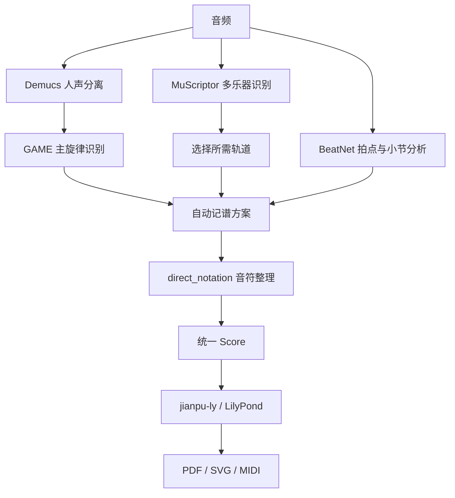

# 音频转简谱 · jianpu-score

在本机把歌曲人声、钢琴或其他乐器的音频转换成简谱，支持网页试听、乐器选择，以及 **PDF、SVG 和 MIDI** 下载。

本说明对应 **`normal` 分支**，默认使用「直接简谱」生成方式。项目面向 Windows 本地运行，音频处理在本机完成；首次安装依赖、准备模型和加载音色库可能需要联网。

## 快速启动

**如果这台电脑已经配置好环境，直接双击项目根目录的 [`启动简谱PDF.cmd`](启动简谱PDF.cmd)。**

脚本会启动后台服务并打开 [简谱网页](http://127.0.0.1:8012)。已经运行时会复用现有服务，不会重复启动。关闭浏览器或启动窗口后，服务仍会在后台运行。

也可以在项目根目录打开 PowerShell：

```powershell
.\scripts\start_pdf_server.ps1

# 只启动服务，不自动打开浏览器
.\scripts\start_pdf_server.ps1 -NoBrowser
```

启动脚本要求当前分支为 `normal`，且本机已有 Python 环境和前端构建。它不会自动安装依赖、下载模型或构建前端。新电脑请先完成下方的「首次安装」。

> 本分支的 PDF 网页入口是 **8012**。旧的 `start_server.ps1` 默认使用 8000 和另一套任务目录，日常使用请以 `启动简谱PDF.cmd` 为入口。

## 怎么使用

支持 **MP3、WAV、FLAC、M4A**，单文件不超过 **100 MiB**、时长不超过 **15 分钟**。

### 扒歌曲人声

1. 上传音频，选择「人声」，保留默认的「直接简谱」。
2. 选择人声分离模型：默认 `htdemucs`，也可以选择耗时更长的 `htdemucs_ft`。
3. 等待人声分离完成，对比试听原曲和分离后的人声。
4. 点击「下一步 · 生成人声简谱」，等待旋律识别与排版。
5. 查看简谱，在下载区保存 PDF、SVG 或 MIDI。

这条流程提取的是**人声主旋律**。分离出来的人声可能残留伴奏，多人合唱也不保证能完整拆成不同声部。

### 扒钢琴、伴奏或纯音乐

1. 上传音频，选择「伴奏 / 纯音乐」，保留默认的「直接简谱」。
2. 等待 MuScriptor 完成整段音频的乐器与音符识别。
3. 在乐器清单勾选需要的轨道，通过钢琴卷帘和「播放选中轨」检查结果。
4. 点击「生成分谱」，查看组合谱、乐器分谱并下载。

勾选的轨道同时控制卷帘显示、合成试听、选择 MIDI 和分谱。更换勾选后重新生成，会复用已经识别的音符，无需再次运行 MuScriptor。

- **鼓组**可以保留在试听和选择 MIDI 中，不生成简谱。
- **「另外生成单声部主旋律」**会另做一份只保留单音旋律的谱，会丢失和声。
- **本机合成试听**是用识别音符重新演奏，不是从原曲分离出的真实乐器录音。

### 下载文件

| 格式 | 用途 |
| --- | --- |
| 简谱 PDF | 阅读、打印和分享分页乐谱 |
| 简谱 SVG | 查看矢量长图，放大或导入支持 SVG 的软件 |
| MIDI（`.mid`） | 在编曲软件中播放、检查和继续编辑音符 |

下载区只提供这三类文件。任务内部的音符数据、JSON、日志等保存在本机目录，不作为普通下载项展示。页面同时提供分页 SVG 预览。

## 不懂乐理也可以先用默认设置

人声和伴奏都支持**自动选择记谱方案**，不需要先输入 BPM 或调性。系统会比较拍速与调性候选；伴奏生成时还会结合所选乐器重新选择。

| 页面上的内容 | 含义 |
| --- | --- |
| BPM | 每分钟的拍数，表示谱面的记谱速度 |
| 拍号，如 `4/4` | 以四分音符为一拍，每小节四拍 |
| 调性，如 `F#m` | F♯ 小调；下拉框会同时显示中文名和简谱对应关系 |
| `1=A` | 简谱数字 `1` 对应 A 音，与 BPM 无关 |
| 高音、和声、低音 | 为复音排版划分的声部，不等于已经识别钢琴左右手 |

本项目的小调采用相对大调的数字对应关系，所以 **F♯ 小调可以显示为 `F#m · 1=A`**，主音 F♯ 对应数字 `6`。

多行谱要按共同的小节和拍点一起读：**同一时刻的不同声部一起弹**，不是弹完高音一行再弹和声、低音。休止符表示该声部在对应位置停顿。

如果试听或谱面明显不合适，再勾选「手动调整调性与速度（可选）」覆盖 BPM、调性和拍号。直接简谱还支持：

- **最短时值**：默认十六分音符，也可选择八分或三十二分音符，影响音符起止位置的量化精细程度。
- **半速记谱**：同时调整记谱 BPM 和音符位置，设计上保持实际试听速度。自动选择后通常不需要额外开启。
- **调号与转调**：例如 `1:Eb, 56:E`，表示第 1 小节为降 E、第 56 小节起改为 E。小节编号从完整谱的开头计算，包含前奏；目前需要手动指定转调。

更详细的处理规则见 [直接简谱说明](docs/direct-jianpu.md)。

## 首次安装

以下步骤在 **Windows PowerShell** 中执行。安装脚本会下载依赖，请按实际需要安装人声或伴奏环境；已经配置好的电脑无需重复执行。

### 1. 准备运行环境和源码

| 组件 | 用途与要求 |
| --- | --- |
| Git、PowerShell | 获取源码、运行启动及安装脚本 |
| Python 3.10 | 用于后端及人声、MuScriptor 的独立环境 |
| Python 3.9 | 单独供 BeatNet 使用，其固定的旧版依赖不能直接装进 Python 3.10 |
| uv | 创建并安装 BeatNet、MuScriptor 环境，命令需在 PATH 中可用 |
| Node.js | 前端安装、构建与测试；可使用 22.12 或更高的 22.x 版本 |
| FFmpeg、ffprobe | 音频解码和信息读取，命令需在 PATH 中可用 |
| NVIDIA 显卡及可用 CUDA 驱动 | 当前网页的 MuScriptor 伴奏识别使用 CUDA；人声 GAME 使用 CPU |

```powershell
git clone --branch normal https://github.com/Azamty/-.git jianpu-score
cd jianpu-score
```

已有仓库时直接进入项目目录，不需要重新克隆。后续命令均从项目根目录执行。

### 2. 安装后端、排版工具和拍点模型

确保默认 `python` 指向 Python 3.10，且 `uv python find 3.9` 能找到已安装的 Python 3.9：

```powershell
.\scripts\bootstrap.ps1
.\scripts\install_lilypond.ps1
.\scripts\install_high_accuracy.ps1 -SkipMusic21
```

这会分别准备 `.venv`、项目内的 LilyPond 2.24.4 和 `.venv-model-beatnet`。直接简谱由 LilyPond 生成 PDF，不需要 MuseScore 或 music21。

有多个 Python 时，可给 `bootstrap.ps1` 传 `-PythonExe`，给 `install_high_accuracy.ps1` 传 `-Python39` 指定解释器的完整路径。若提示未找到 Python 3.9，说明 BeatNet 被跳过了，仍需补齐后才能完成拍点分析。

### 3. 安装需要的识别模型

**生成人声简谱：**

```powershell
.\scripts\install_models.ps1 -Model demucs
.\scripts\install_models.ps1 -Model game
```

另外需要准备 GAME small 预训练模型。来源说明见 [随项目保留的 GAME README](vendor/GAME-1.0.3/README.md)，默认目录应包含：

```text
.cache/models/game/GAME-1.0-small/
├── model.pt
├── config.yaml
└── lang_map.json
```

也可用环境变量 `JIANPU_GAME_MODEL` 指定 `model.pt`，配置与语言映射文件仍需放在权重旁边。依赖安装成功不代表这些权重已就绪；Demucs 也需要对应分离模型的权重。

**生成伴奏 / 纯音乐简谱：**

```powershell
.\scripts\install_muscriptor.ps1
```

默认安装 MuScriptor 0.3.0 和 `cu128` PyTorch 环境。脚本也接受 `-TorchBackend cu126` 或 `cu124`；应与本机驱动能力匹配。虽然安装器有 `cpu` 参数，**当前网页的伴奏任务仍默认使用 CUDA**。

MuScriptor medium 权重需要另行准备。可复用本机 Hugging Face 的 `MuScriptor/muscriptor-medium` 缓存，或用 `MUSCRIPTOR_MODEL_PATH` 指向本地 `model.safetensors`。需要访问授权的模型，应先在本机完成相应授权和认证。

上述模型安装脚本均可通过 `-PythonExe` 指定 Python 3.10。第三方源码、模型权重和音色库分别以各自的许可与使用说明为准。

### 4. 构建前端并启动

```powershell
Push-Location .\frontend
npm ci
npm run build
Pop-Location

.\scripts\start_pdf_server.ps1
```

之后日常使用只需双击 `启动简谱PDF.cmd`。更新前端源码后需要重新执行 `npm run build`。

高质量合成试听使用 SpessaSynth 和 MuseScore General SF3，首次使用可能需要下载音色库，也可使用页面提供的轻量试听。缓存与可选预取步骤见 [音色库说明](docs/muscriptor-soundfont.md)。

## 任务、缓存与日志

通过 PDF 启动脚本运行时，任务保存在：

```text
artifacts/review/direct-jianpu/
├── jobs/<任务 ID>/       # 音频、识别结果、简谱和任务记录
├── server.stdout.log    # 服务标准输出
├── server.stderr.log    # 服务错误日志
└── server.pid           # 启动进程记录
```

可以收藏页面带有 `?job=...` 的地址，之后在同一台电脑、同一份项目中打开已有结果。PDF 启动入口关闭了通用服务的定时过期清理，任务会保留在磁盘上；空间不足时需自行备份并清理不再需要的任务。

模型、缓存、用户音频和生成结果不随源码一起迁移。换电脑后，即使从 GitHub 拉取了项目，也需要重新配置环境，并单独迁移需要保留的任务和模型。

## 常见问题

| 现象 | 检查方式 |
| --- | --- |
| 双击提示分支不符 | 用 `git branch --show-current` 检查是否为 `normal`；脚本不会自动切换分支 |
| 提示缺少 Python 环境 | 检查 `.venv/Scripts/python.exe`，首次安装运行 `bootstrap.ps1` |
| 提示缺少前端构建 | 在 `frontend` 目录执行 `npm ci`、`npm run build` |
| 8012 被占用 | 确认是否有其他程序占用；启动器只复用本项目服务，不会自动结束其他进程 |
| 页面打开了，识别却失败 | 查看任务失败阶段和服务日志；网页可访问只表示后端已启动，不表示模型、CUDA 和权重都齐全 |
| 音频读取失败 | 检查格式、大小、时长及 ffmpeg/ffprobe；也可通过 `JIANPU_FFMPEG`、`JIANPU_FFPROBE` 指定可执行文件路径 |
| 找不到 PDF 下载 | 等待简谱生成完成并查看下载区；旧任务不会自动补出新产物，必要时用「直接简谱」重新生成 |
| 旧任务不见了 | 确认打开的是 8012，任务目录仍在当前项目中；8000 的通用服务使用另一套任务目录 |
| 觉得谱面或 MIDI 变快了 | 对照原曲检查起拍、拍速和音符时值；自动拍点、倍速判断及量化都可能出错，不要只凭 BPM 数值判断 |
| 高质量试听一直加载 | 检查音色库下载状态，或点击「立即使用轻量试听」 |

需要观察启动日志并用 `Ctrl+C` 结束服务时，可在 **8012 未被后台服务占用** 的情况下以前台方式运行：

```powershell
.\.venv\Scripts\python.exe .\scripts\direct_jianpu_server.py
```

健康检查：[服务状态](http://127.0.0.1:8012/api/health)。环境信息：[能力检测](http://127.0.0.1:8012/api/capabilities)。能力检测会同时列出旧引擎组件；直接简谱不依赖其中的 MuseScore 和 music21。

## 工作原理与开发



人声按单旋律整理，伴奏保留复音和各音符的独立时值；统一 Score 负责小节、休止、延音与转调的表达。旧的 MuseScore 记谱路径仍可在页面选择，但需要另行准备其依赖。

| 目录 | 内容 |
| --- | --- |
| `backend/` | FastAPI 接口、任务调度、模型适配和简谱生成 |
| `frontend/` | React / TypeScript 页面、钢琴卷帘与合成试听 |
| `scripts/` | 环境安装、启动、诊断与回归脚本 |
| `requirements/` | 后端及各模型环境的依赖约束 |
| `vendor/` | 随项目保留的第三方源码与兼容调整 |
| `tests/` | 后端与记谱测试 |
| `docs/` | 处理规则与专项说明 |

在已安装开发依赖的环境中，可运行直接简谱相关测试和前端检查：

```powershell
.\.venv\Scripts\python.exe -m pytest tests/test_direct_notation.py tests/test_notation_advice.py tests/test_frontend_contract.py -q

Push-Location .\frontend
npm run test:frontend
npm run build
Pop-Location
```

已有音符和拍点缓存时，可以用 `scripts/direct_notation_smoke.py` 复跑记谱流程，参数见 `--help`。歌曲回归测试 `tests/test_direct_song_regression.py` 依赖本机音频处理缓存，缺少缓存时会跳过。

提交代码前查看 `git status`，只暂存需要的源码或文档。不要提交虚拟环境、模型权重、认证信息、用户音频和生成结果；`.artifacts/` 与 `artifacts/` 是两个不同目录，不能假定前者也被 Git 忽略。

## 当前边界

自动生成的简谱适合作为试听、练习和人工修订的起点。复杂复音、弱起、自由速度、三连音、滑音、踏板及乐器误分类仍可能影响结果；目前不自动识别转调和钢琴左右手。

项目会回读排版生成的 MIDI，检查它与内部 Score 的音高、起止时值是否一致。这能验证记谱输出的一致性，**不代表音频识别准确率**。目前没有足够的人工标注实曲评测来给出可信的统一正确率，建议先用熟悉的片段对照原曲检查。
